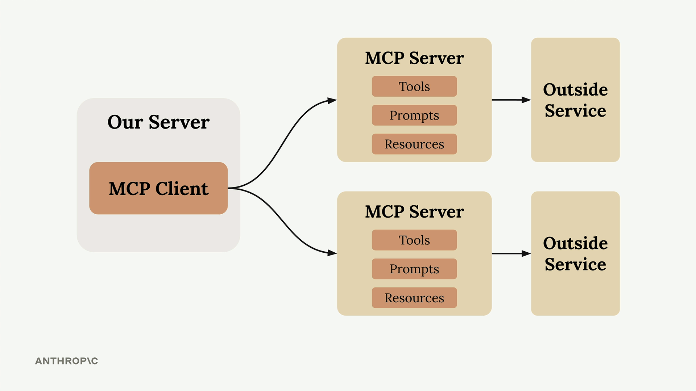
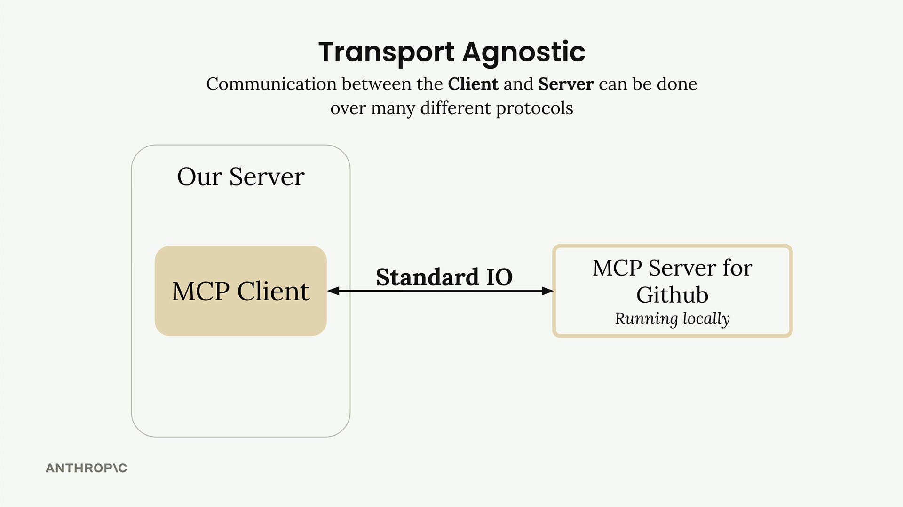
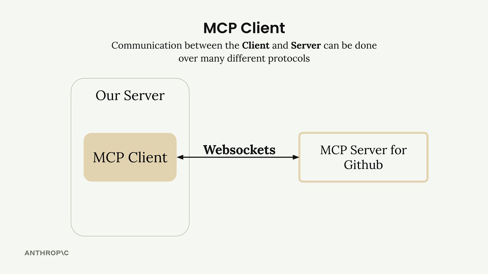
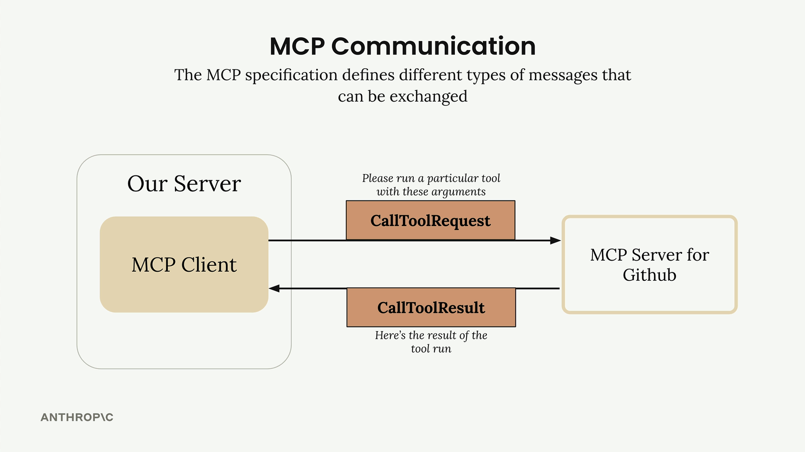

# **Report on the Model Context Protocol (MCP)**

## **What is the Model Context Protocol (MCP)?**

The **Model Context Protocol (MCP)** is an innovative paradigm for communication between large language models (**LLMs**) and external tools. MCP provides an abstraction layer that allows the model to access operational context and specialized tools without the need to manually implement integration code for each service. This greatly simplifies and modularizes the development of LLM-based applications.

## **The Problem Addressed by MCP**

Developing intelligent systems that use LLMs in real-world environments often requires access to complex external services, such as public or private APIs. For example, consider an application where a user wants to ask the LLM questions about their GitHub data: a request like *"What open pull requests do I have in all my repositories?"* requires deep knowledge of the GitHub API and the ability to make contextual calls.

Without MCP, the development team would need to:

* Manually define and implement each tool corresponding to GitHub functionalities.
* Manage communication between the model and the external service.
* Write and maintain a considerable amount of integration code.
* Ensure constant updates in case of changes to external APIs.

This approach is **onerous, complex, and difficult to scale**, especially when supporting numerous services and tools.

MCP addresses this problem in a structured way, allowing the **implementation, execution, and maintenance of tools** to be delegated to specialized servers (MCP Server), drastically reducing complexity on the application (client) side.

## **Structure and Operation of the Model Context Protocol**

MCP is based on two main components:

* **MCP Client**: The main interface between your server and one or more MCP Servers. It handles sending requests, receiving responses, and managing the communication protocol.
* **MCP Server**: A specialized interface that encapsulates access to an external service (e.g., GitHub), exposing a standardized set of tools and resources usable by the LLM.
---

---

A key aspect of MCP is its **transport agnosticism**. The protocol can be implemented using various communication channels, including:

* **Standard Input/Output** (on the same host)
* **HTTP**
* **WebSocket**
* **Other network protocols**

   
   

## **Message Types**

The MCP protocol defines a series of messages that regulate communication between client and server. The most important include:

* `ListToolsRequest` / `ListToolsResult`: Allows the client to obtain the list of tools available on a given MCP Server.
* `CallToolRequest` / `CallToolResult`: Allows invoking a specific tool and obtaining the execution result.

## **Complete Operational Flow: From LLM to External Service**

--

The following sequence describes the complete interaction flow between user, application, LLM, MCP, and an external service. This diagram highlights the **modularity** and **clarity of responsibilities** offered by MCP:

1. **User Request**  
   The user sends a request to the application, for example:  
   *"What repositories do I have on GitHub?"*

2. **Tool Discovery**  
   The application needs to know which tools it can make available to the LLM to answer the question.

3. **Querying the MCP Client**  
   The application sends a `ListToolsRequest` (request to know available tools) to the **MCP client**, the component that acts as a bridge between the application and the MCP server.

4. **Response from the MCP Server**  
   The **MCP server** (specialized service managing access to an external tool, such as the GitHub API) responds with a `ListToolsResult`, containing the list of available tools (e.g., `get_repos`, `get_pull_requests`, etc.).

5. **Forwarding to the LLM**  
   The application passes both the user's request and the list of available tools to the LLM.

6. **LLM Decision**  
   The LLM analyzes the request and decides to use a specific tool to obtain the required information (e.g., `get_repos`).

7. **Tool Execution**  
   The application sends a `CallToolRequest` (tool execution request) to the MCP client, specifying the chosen tool and necessary parameters.

8. **Call to External Service**  
   The MCP server makes the call to the external service (e.g., the GitHub API) and collects the requested data.

9. **Tool Response**  
   The obtained data is returned to the MCP client via a `CallToolResult` message.

10. **Delivering Data to the LLM**  
    The application receives the data from the MCP client and sends it to the LLM.

11. **Formulating the Final Response**  
    The LLM generates a textual response based on the information received.

12. **Response to the User**  
    Finally, the application returns the generated response to the user.

## **Conclusion**

The **Model Context Protocol** is an effective and scalable answer to the growing complexity of integrating LLMs with external services. MCP allows you to fully delegate tool management to dedicated servers, making it easier to develop complex applications and drastically reducing development and maintenance overhead.

The transparency of the control flow and the clear separation of responsibilities make MCP the ideal architecture for building intelligent systems that can dynamically interact with the external world.
