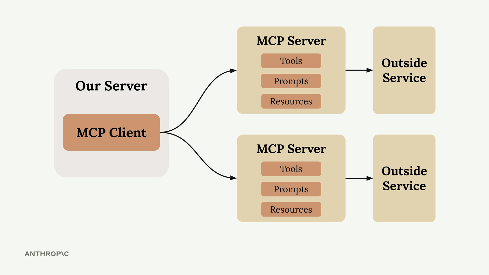
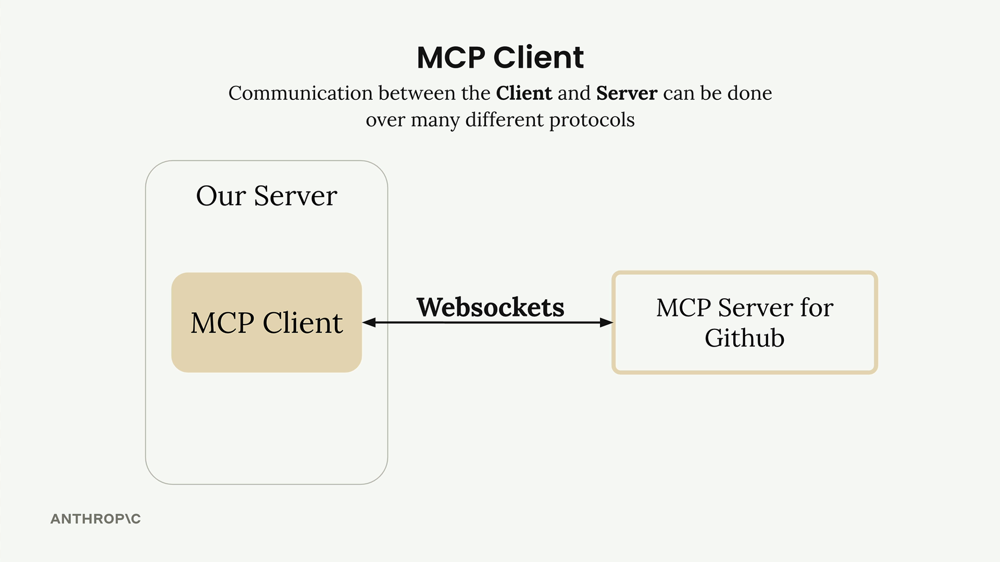
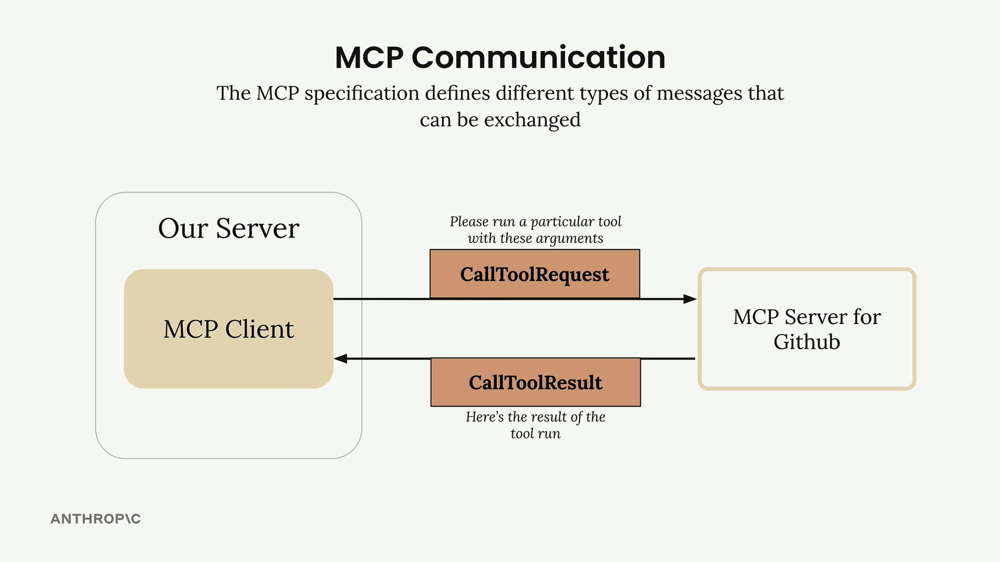

# **Relazione sul Model Context Protocol (MCP)**

## **Cos'è il Model Context Protocol (MCP)**

Il **Model Context Protocol (MCP)** rappresenta un paradigma innovativo di comunicazione tra modelli linguistici di grandi dimensioni (**LLM**) e strumenti esterni. MCP fornisce un livello di astrazione che consente di fornire al modello contesto operativo e accesso a strumenti specializzati senza la necessità di implementare manualmente codice di integrazione per ciascun servizio. In questo modo, lo sviluppo di applicazioni basate su LLM risulta notevolmente semplificato e più modulare.

## **Il problema affrontato da MCP**

Lo sviluppo di sistemi intelligenti che utilizzano LLM in ambienti reali spesso richiede l'accesso a servizi esterni complessi, come ad esempio API pubbliche o private. Consideriamo, ad esempio, un'applicazione in cui l'utente desidera porre domande al LLM sui propri dati GitHub: una richiesta come *"Quali pull request aperte ho in tutti i miei repository?"* implica una conoscenza approfondita dell'API di GitHub e la capacità di effettuare chiamate contestuali.

Senza MCP, il team di sviluppo dovrebbe:

* Definire e implementare manualmente ogni singolo strumento (tool) corrispondente alle funzionalità di GitHub.
* Gestire la comunicazione tra il modello e il servizio esterno.
* Scrivere e mantenere un considerevole volume di codice di integrazione.
* Garantire aggiornamenti costanti in caso di modifiche alle API esterne.

Questo approccio è **oneroso, complesso e difficile da scalare**, soprattutto quando si vogliono supportare numerosi servizi e strumenti.

MCP affronta questo problema in modo strutturato, consentendo di **delegare l'implementazione, l'esecuzione e la manutenzione degli strumenti** a server specializzati (MCP Server), riducendo drasticamente la complessità sul lato applicativo (client).

## **Struttura e funzionamento del Model Context Protocol**

MCP si basa su due componenti principali:

* **MCP Client**: È l'interfaccia principale tra il tuo server e uno o più MCP Server. Si occupa di inviare richieste, ricevere risposte e gestire il protocollo di comunicazione.
* **MCP Server**: È un'interfaccia specializzata che incapsula l'accesso a un servizio esterno (es. GitHub), esponendo un insieme standardizzato di strumenti e risorse utilizzabili dal LLM.
---

---

Un aspetto fondamentale di MCP è la sua **indipendenza dal trasporto** (“transport agnostic”). Il protocollo può essere implementato usando diversi canali di comunicazione, tra cui:

* **Input/Output standard** (sul medesimo host)
* **HTTP**
* **WebSocket**
* **Altri protocolli di rete**

   
   

## **Tipi di messaggi**

Il protocollo MCP definisce una serie di messaggi che regolano la comunicazione tra client e server. Tra i più importanti:

* `ListToolsRequest` / `ListToolsResult`: Permette al client di ottenere la lista degli strumenti disponibili presso un dato MCP Server.
* `CallToolRequest` / `CallToolResult`: Permette di invocare uno specifico strumento ed ottenere il risultato dell’esecuzione.

## **Flusso operativo completo: dal LLM al servizio esterno**

--

La seguente sequenza descrive il flusso completo di interazione tra utente, applicazione, LLM, MCP e un servizio esterno. Questo schema evidenzia la **modularità** e la **chiarezza delle responsabilità** offerte da MCP:

1. **Richiesta dell’utente**
   L'utente invia una richiesta all'applicazione, ad esempio:
   *"Quali repository ho su GitHub?"*

2. **Scoperta degli strumenti**
   L'applicazione ha bisogno di sapere quali strumenti può mettere a disposizione del LLM per rispondere alla domanda.

3. **Interrogazione del client MCP**
   L'applicazione invia una `ListToolsRequest` (richiesta per conoscere gli strumenti disponibili) al **client MCP**, il componente che funge da ponte tra l’applicazione e il server MCP.

4. **Risposta dal server MCP**
   Il **server MCP** (servizio specializzato che gestisce l’accesso a uno strumento esterno, come l’API di GitHub) risponde con una `ListToolsResult`, contenente la lista degli strumenti disponibili (es. `get_repos`, `get_pull_requests`, ecc.).

5. **Inoltro al LLM**
   L'applicazione passa al LLM sia la richiesta dell’utente che la lista degli strumenti disponibili.

6. **Decisione del LLM**
   Il LLM analizza la richiesta e decide di utilizzare uno specifico strumento per ottenere le informazioni richieste (ad esempio `get_repos`).

7. **Esecuzione dello strumento**
   L'applicazione invia una `CallToolRequest` (richiesta di esecuzione di uno strumento) al client MCP, specificando lo strumento scelto e i parametri necessari.

8. **Chiamata al servizio esterno**
   Il server MCP esegue la chiamata verso il servizio esterno (ad esempio l’API di GitHub) e raccoglie i dati richiesti.

9. **Risposta dello strumento**
   I dati ottenuti vengono restituiti al client MCP tramite un messaggio `CallToolResult`.

10. **Consegna dei dati al LLM**
    L'applicazione riceve i dati dal client MCP e li invia al LLM.

11. **Formulazione della risposta finale**
    Il LLM elabora una risposta testuale basata sulle informazioni ricevute.

12. **Risposta all’utente**
    Infine, l'applicazione restituisce la risposta generata all’utente.

## **Conclusione**

Il **Model Context Protocol** è una risposta efficace e scalabile alla crescente complessità di integrazione tra LLM e servizi esterni. MCP consente infatti di delegare completamente la gestione degli strumenti a server dedicati, rendendo più facile sviluppare applicazioni complesse e riducendo drasticamente l’onere di sviluppo e manutenzione.

La trasparenza del flusso di controllo e la netta separazione delle responsabilità rendono MCP l’architettura adatta per costruire sistemi intelligenti che possono interagire dinamicamente con il mondo esterno.  
